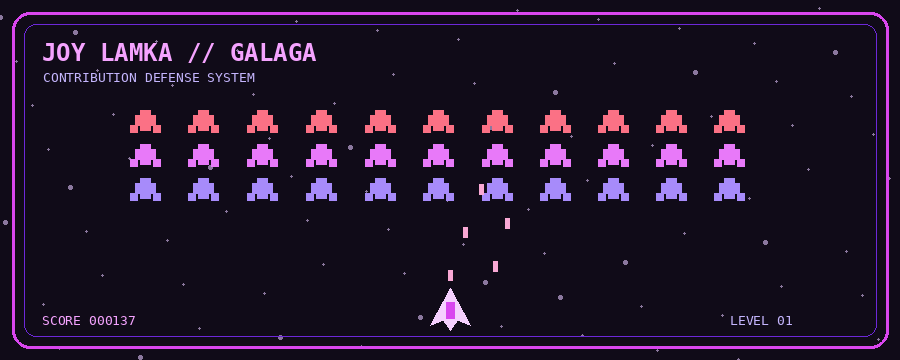

# Setup

1. Create a public GitHub profile repository named exactly after your GitHub username.
2. Copy `README.md` and the `assets` folder into the repository root.
3. Confirm that `assets/galaga-arcade.gif` is committed.
4. Replace `jlamka` in the README if your GitHub username is different.

## Why the arcade works

The arcade is a self-contained animated GIF stored directly in the repository:

```text
assets/galaga-arcade.gif
```

The README references it with a relative path:

```html

```

This avoids depending on an external contribution-graph service or a generated branch.

GitHub can display the GIF directly in the profile README.

## Removed

The previous version's banner and GitHub telemetry/statistics have intentionally been removed.
